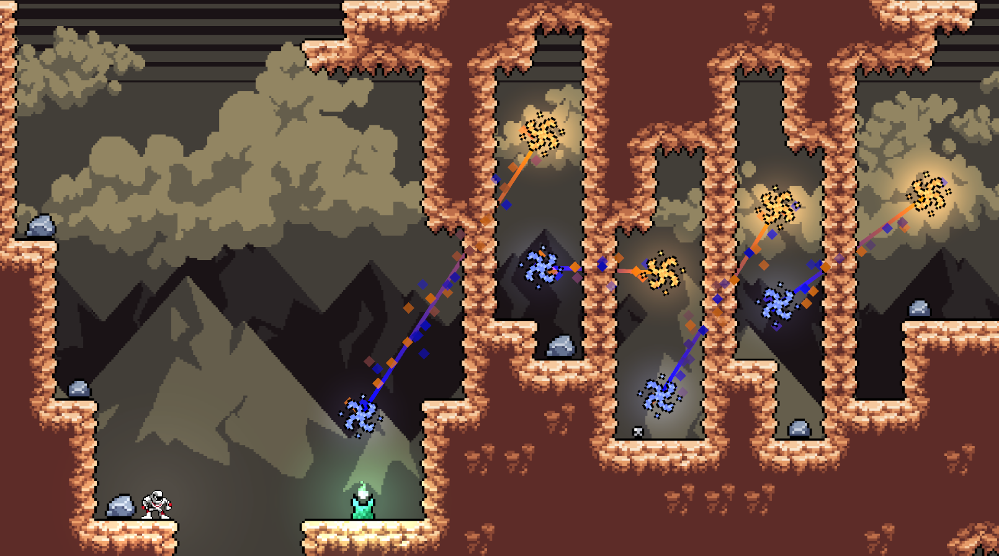

# APOLLO

This is a game I've been working on with the hopes of uploading it somewhere eventually. It started as a school project, but I'm planning to do more with it.

The game has several new platforming features and takes great inspiration from games like Celeste.

## 🚀 About Me
Hey! I'm Rishi Aitha, a high-school student who's interested in game and web development. This is one of my first big game projects, and everything is stored in this repo!

## Screenshots

## Credits/Acknowledgements

Artwork (some pixel art is my own):
- [Pixel Heroes Megapack](https://assetstore.unity.com/packages/2d/characters/pixel-heroes-megapack-271664) -- Hippo
- [CosmicMan](https://assetstore.unity.com/packages/2d/characters/cosmicman-167448) -- Quantum Fox Studio

Sounds:
- [Classic Footstep SFX](https://assetstore.unity.com/packages/audio/sound-fx/classic-footstep-sfx-173668) -- Matthew Anett
- [Free - Sci-Fi and Cyberpunk Music Pack](https://assetstore.unity.com/packages/audio/ambient/sci-fi/free-sci-fi-and-cyberpunk-music-pack-264590) -- SLD Audio
- [Free UI Click Sound Pack](https://assetstore.unity.com/packages/audio/sound-fx/free-ui-click-sound-pack-244644) -- SwishSwoosh
- [Nature - Essentials](https://assetstore.unity.com/packages/audio/ambient/nature/nature-essentials-208227) -- Nox_Sound
- [Shapeforms Audio Free Sound Effects](https://assetstore.unity.com/packages/audio/sound-fx/shapeforms-audio-free-sound-effects-183649) -- Shapeforms

Fonts:
- [Comfortaa](https://fonts.google.com/specimen/Comfortaa) -- Johan Aakerlund
- [Jaro](https://fonts.google.com/specimen/Jaro) -- Agyei Archer, Celine Hurka, Mirko Velimirović

Playtesters:
- Leo Sun

Special Thanks:
- Thanks to my computer science teacher for teaching us Unity and making this assignment!
